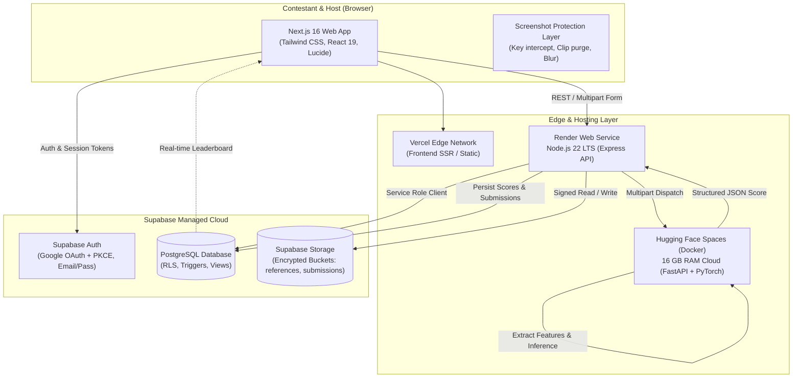
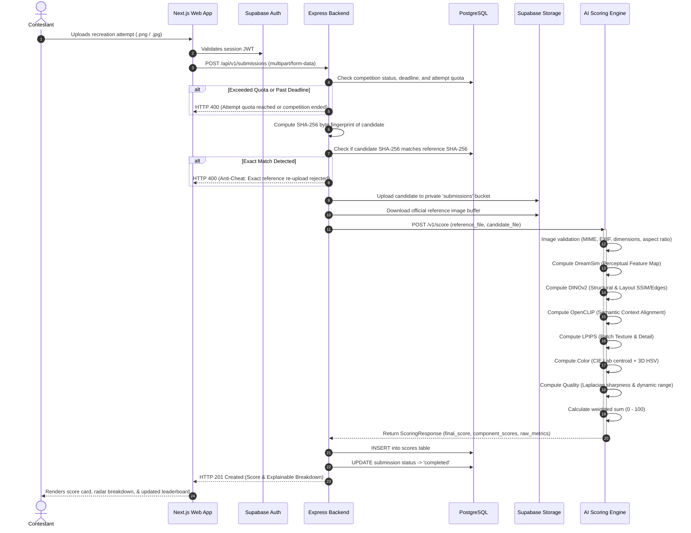
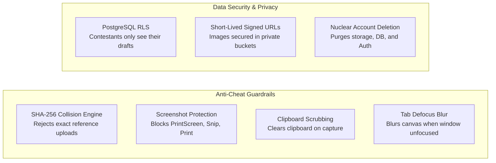

# AI Image Judge Platform
### Institutional AI Image Recreation Competition & Vision Evaluation System

[](https://fastapi.tiangolo.com)
[](https://nextjs.org)
[](https://expressjs.com)
[](https://pytorch.org)
[](https://supabase.com)
[](https://render.com)
[](https://vercel.com)

A production-grade, user-driven competitive platform designed for **AI Image Recreation Challenges**. Contestants are presented with an official reference visual and must recreate it using generative AI tools (Midjourney, Stable Diffusion, DALL-E, Flux, ComfyUI, etc.).

Submissions are evaluated by an automated, explainable **Multi-Metric Vision Ensemble** combining deep perceptual representations, self-supervised structural correspondences, semantic concept alignment, local patch detail fidelity, color space distributions, and technical sharpness to produce a calibrated **Reference Similarity Score (0–100)** and live ranked leaderboard.

---

## Table of Contents

- [Live Deployment Links](#live-deployment-links)
- [System Architecture](#system-architecture)
- [Core Workflow & Google Meet Flow](#core-workflow--google-meet-flow)
- [Vision Models & 6-Metric Scoring Ensemble](#vision-models--6-metric-scoring-ensemble)
  - [Why Multi-Metric Vision Scoring?](#why-multi-metric-vision-scoring)
  - [Metric 1: DreamSim (Perceptual Similarity)](#metric-1-dreamsim-perceptual-similarity-35-weight)
  - [Metric 2: DINOv2 (Structural & Layout Correspondence)](#metric-2-dinov2-structural--layout-correspondence-30-weight)
  - [Metric 3: OpenCLIP (Semantic & Context Alignment)](#metric-3-openclip-semantic--context-alignment-15-weight)
  - [Metric 4: LPIPS (Patch Texture & Detail Fidelity)](#metric-4-lpips-patch-texture--detail-fidelity-10-weight)
  - [Metric 5: Color Distribution (HSV + CIE L\*a\*b\*)](#metric-5-color-distribution-5-weight)
  - [Metric 6: Technical Image Quality & Integrity](#metric-6-technical-image-quality--integrity-5-weight)
  - [Composite Formulation & Calibration](#composite-formulation--calibration)
  - [Low-Memory Execution Mode (512MB RAM Hosting)](#low-memory-execution-mode-512mb-ram-hosting)
- [Security, Anti-Cheat & Privacy](#security-anti-cheat--privacy)
  - [1. Byte-Level Anti-Cheat Fingerprinting](#1-byte-level-anti-cheat-fingerprinting)
  - [2. Site-Wide Anti-Cheat Screenshot Prohibition](#2-site-wide-anti-cheat-screenshot-prohibition)
  - [3. Submission Quotas & Deadline Enforcement](#3-submission-quotas--deadline-enforcement)
  - [4. Database Security & Row Level Security (RLS)](#4-database-security--row-level-security-rls)
  - [5. Permanent Account & Data Deletion (GDPR / Safety)](#5-permanent-account--data-deletion-gdpr--safety)
- [Repository Structure](#repository-structure)
- [API Reference](#api-reference)
  - [Backend Express API](#backend-express-api)
  - [AI Scoring Engine FastAPI](#ai-scoring-engine-fastapi)
- [Local Setup & Development](#local-setup--development)
- [Testing & Quality Assurance](#testing--quality-assurance)

---

## Live Deployment Links

| Component | Platform | Environment URL | Status |
| :--- | :--- | :--- | :--- |
| **Frontend Web App** | Vercel | Hosted on Vercel Edge Network | Active |
| **Backend API** | Render | `https://ai-judge-backend.onrender.com` | Healthy |
| **AI Scoring Engine** | Hugging Face Spaces | `https://<username>-<space-name>.hf.space` (16 GB RAM) | Active |
| **Database & Auth** | Supabase | `https://llexnyzdvqjgvlrvzdgr.supabase.co` | Connected |

---

## System Architecture

The platform follows a three-tier microservices architecture with strict separation of concerns:



### End-to-End Submission Lifecycle



---

## Core Workflow & Google Meet Flow

To eliminate operational friction and avoid rigid multi-tier role configurations, the platform operates on a **peer-to-peer user-driven competition model**:

1. **Anyone Can Host**: Every authenticated contestant can create a competition with a custom title, description, reference image, deadline, and attempt limit.
2. **Cryptographic Room Codes**: When a challenge is created, the system generates a human-readable, non-sequential code formatted as `xxx-xxxx-xxx` (e.g. `k9m-p4x-2wq`).
   - Alphabet consists of 32 unambiguous characters (excludes lookalikes like `0`, `O`, `1`, `l`, `I`).
   - Permutation space exceeds $32^{10} > 1.1 \times 10^{15}$ combinations, preventing brute-force ID guessing.
3. **One-Click Shareable Links**: Hosts can copy a link (`https://.../join/k9m-p4x-2wq`).
4. **Google Meet Style Joining**: Users can enter room codes directly into the navbar or dashboard join bar to jump straight to the competition preview.
5. **Seamless Unauthenticated Redirection**: Unauthenticated visitors can view public landing pages and room previews, but clicking **"Join Competition"** or **"Submit Entry"** transparently stores their `returnUrl` and routes them back after sign-in.

---

## Vision Models & 6-Metric Scoring Ensemble

### Why Multi-Metric Vision Scoring?

Evaluating AI-generated image recreation cannot rely on a single metric:
- **Pixel-level MSE / PSNR** fails because generative models introduce slight pixel shifts, stochastic textures, and stylistic variations that cause massive pixel errors even when the images look identical to humans.
- **Pure CLIP semantic embeddings** fail because CLIP is insensitive to geometry and spatial layout—it cannot distinguish a circle on the left from a circle on the right, or an inverted scene.
- **Pure structural metrics (SSIM)** fail because they do not understand semantic context or color palette atmosphere.

The platform utilizes a **balanced, calibrated 6-metric ensemble** where each component targets a distinct perceptual axis:

| Metric | Target Dimension | Default Weight | Range | Evaluation Method |
| :--- | :--- | :---: | :---: | :--- |
| **DreamSim** | Human Perceptual Similarity | **35%** | $0 - 100$ | Deep learned perceptual embedding distance |
| **DINOv2** | Structural & Layout Alignment | **30%** | $0 - 100$ | Self-supervised visual layout correspondence |
| **OpenCLIP** | Semantic Subject Context | **15%** | $0 - 100$ | Joint vision-language concept cosine similarity |
| **LPIPS** | Patch Texture & Detail | **10%** | $0 - 100$ | Deep convolutional patch texture delta |
| **Color** | Color Palette & Mood | **5%** | $0 - 100$ | CIE $L^*a^*b^*$ centroid + 3D HSV histogram correlation |
| **Quality** | Technical Sharpness & Range | **5%** | $0 - 100$ | Laplacian blur variance + contrast dynamic range |

---

### Metric 1: DreamSim (Perceptual Similarity, 35% Weight)
* **Model Type:** Perceptual Metric Benchmark (learned representation tuned to human perceptual judgments).
* **Why It Is Used:** Standard deep metrics (like raw ImageNet features) diverge from human visual preferences when evaluating generative synthesis artifacts. DreamSim is specifically trained on pairwise synthetic image distortions evaluated by human annotators.
* **How It Works:**
  - Extracts intermediate visual embeddings invariant to minor noise but sensitive to visual composition.
  - Converts raw perceptual distance $d \in [0, 1]$ into a similarity score:
    $$s_{\text{dreamsim}} = \max(0.0, \min(100.0, (1.0 - d) \times 100.0))$$

---

### Metric 2: DINOv2 (Structural & Layout Correspondence, 30% Weight)
* **Model Type:** Self-Supervised Vision Transformer (`facebook/dinov2-small`).
* **Why It Is Used:** DINOv2 learns rich visual representations without text supervision. Its self-attention maps isolate object silhouettes, pose, spatial geometry, and layout arrangement without hallucinating semantic biases.
* **How It Works:**
  - Extracts the $L_2$-normalized CLS representation or patch token distribution.
  - Measures cosine similarity between the reference image and candidate recreation:
    $$s_{\text{dino}} = \max(0.0, \min(100.0, \cos(\mathbf{f}_{\text{ref}}, \mathbf{f}_{\text{cand}}) \times 100.0))$$

---

### Metric 3: OpenCLIP (Semantic & Context Alignment, 15% Weight)
* **Model Type:** OpenCLIP ViT-B-32 trained on LAION-2B / OpenAI weights.
* **Why It Is Used:** Evaluates high-level conceptual fidelity. Ensures the recreation portrays the intended subject matter (e.g. "a vintage camera on a wooden desk" rather than "a typewriter on a stone ledge") regardless of minor lighting differences.
* **How It Works:**
  - Maps both images into the joint multimodal embedding space:
    $$\cos(\mathbf{e}_{\text{ref}}, \mathbf{e}_{\text{cand}}) = \frac{\mathbf{e}_{\text{ref}} \cdot \mathbf{e}_{\text{cand}}}{\|\mathbf{e}_{\text{ref}}\|_2 \|\mathbf{e}_{\text{cand}}\|_2}$$
    $$s_{\text{clip}} = \max(0.0, \min(100.0, \cos(\mathbf{e}_{\text{ref}}, \mathbf{e}_{\text{cand}}) \times 100.0))$$

---

### Metric 4: LPIPS (Patch Texture & Detail Fidelity, 10% Weight)
* **Model Type:** Learned Perceptual Image Patch Similarity (AlexNet/VGG backbone).
* **Why It Is Used:** Operates at local spatial scales to penalize excessive AI smoothing, unnatural painterly blurring, or generative artifact smudging along edges.
* **How It Works:**
  - Computes channel-normalized feature distances across early and intermediate convolution layers.
  - Converts raw patch distance $d_{\text{lpips}}$ to similarity:
    $$s_{\text{lpips}} = \max(0.0, \min(100.0, (1.0 - d_{\text{lpips}}) \times 100.0))$$

---

### Metric 5: Color Distribution (5% Weight)
* **Algorithm:** CIE $L^*a^*b^*$ Color Centroid Euclidean Distance + 3D HSV Histogram Correlation.
* **Why It Is Used:** Deep neural networks can sometimes be color-blind or over-reward monochromatic recreations if the structural outlines match. This metric prevents contestants from submitting black-and-white or palette-inverted variations.
* **How It Works:**
  1. **3D HSV Histogram**: Evaluates $16 \times 8 \times 8$ bins across Hue, Saturation, and Value space using histogram correlation ($r_{\text{hsv}} \in [0, 1]$).
  2. **CIE $L^*a^*b^*$ Centroid**: Computes perceptual Euclidean distance between the mean color vectors ($\Delta E = \|\boldsymbol{\mu}_{\text{ref}} - \boldsymbol{\mu}_{\text{cand}}\|_2$).
  3. **Composite Color Score**:
     $$s_{\text{color}} = (0.50 \cdot r_{\text{hsv}} + 0.35 \cdot \text{sim}_{\text{centroid}} + 0.15 \cdot \text{sim}_{\text{variance}}) \times 100.0$$

---

### Metric 6: Technical Image Quality & Integrity (5% Weight)
* **Algorithm:** Laplacian Operator Variance ($\sigma_{\text{Lap}}^2$) + Grayscale Contrast Standard Deviation + Resolution Adequacy Factor.
* **Why It Is Used:** Prevents contestants from submitting corrupted, pixelated, washed out, or over-compressed images.
* **How It Works:**
  - Evaluates edge sharpness via the variance of the 2D Laplacian:
    $$\sigma_{\text{Lap}}^2 = \text{Var}(\nabla^2 I)$$
  - Evaluates contrast through the standard deviation of intensity levels.
  - Penalizes sub-standard resolutions (< 512px).
  - Kept at 5% so artistic alignment to the reference always dominates the score.

---

### Composite Formulation & Calibration

The final **Reference Similarity Score** ($S$) is computed as:

$$S = \sum_{i \in \{\text{dreamsim, dino, clip, lpips, color, quality}\}} w_i \cdot s_i$$

$$\sum w_i = 1.0, \quad S \in [0.00, 100.00]$$

#### Mathematical Guarantees:
- **Identity Invariant**: If $I_{\text{candidate}} == I_{\text{reference}}$, all component similarities evaluate to $100.0$, guaranteeing $S = 100.0$.
- **Anti-Hallucination**: A blank, inverted, or completely uncorrelated image scores near $0.0$.
- **Deterministic**: Given identical candidate and reference byte streams, the scoring engine produces identical scores every time.

---

### Low-Memory Execution Mode (512MB RAM Hosting)

To allow the platform to be hosted on free-tier cloud containers (such as **Render Free Tier**, which caps container memory at **512MB RAM**), the service features a built-in `LOW_MEMORY_MODE`:

```text
Full Transformers Mode (GPU / 2GB+ RAM):
├── DINOv2-small ViT (~87MB weights, ~400MB RAM)
├── OpenCLIP ViT-B-32 (~340MB weights, ~500MB RAM)
├── DreamSim ViT-B-16 (~600MB weights, ~600MB RAM)
└── LPIPS AlexNet (~60MB weights, ~150MB RAM)
Total Footprint: ~1.6 GB RAM

LOW_MEMORY_MODE=true (512MB RAM Cap - Render Free Tier):
├── MobileNetV3-Small (~9.8MB weights, ~25MB RAM)
│   ├── High-Level 7x7 Spatial Grid Correlation -> maps to DreamSim
│   ├── Top-Layer ImageNet Semantic Distribution -> maps to CLIP
│   └── Layers 0-4 Mid-Level Convolutional Delta -> maps to LPIPS
├── OpenCV Multi-Scale SSIM & Sobel Edge Maps -> maps to DINOv2
└── OpenCV CIE Lab + HSV Histogram Engine -> maps to Color & Quality
Total Footprint: ~170 MB RAM (Runs safely inside 512MB!)
```

This ensures identical output schemas and explainability without risking Linux kernel Out-Of-Memory (OOM) kills.

---

## Security, Anti-Cheat & Privacy



### 1. Byte-Level Anti-Cheat Fingerprinting
- When an image is submitted, the backend computes its SHA-256 cryptographic hash.
- If the candidate hash matches the reference hash, the upload is immediately rejected with an `Anti-Cheat: Exact reference image match detected` flag.
- Failed attempts do not count against the contestant's quota.

### 2. Site-Wide Anti-Cheat Screenshot Prohibition
To preserve competition integrity and prevent reference leakage or prompt-stealing, the frontend includes a global anti-capture shield ([`frontend/components/ScreenshotProtection.tsx`](file:///c:/Users/ASUS/OneDrive/Desktop/aiphoto/frontend/components/ScreenshotProtection.tsx)):
- **Hardware Intercept**: Captures and cancels `PrintScreen`, macOS screenshot shortcuts (`Cmd+Shift+3`, `Cmd+Shift+4`, `Cmd+Shift+5`), Windows Snipping Tool (`Ctrl+Shift+S`), and browser print dialogs (`Ctrl+P`).
- **Clipboard Scrubbing**: Writes empty text to the system clipboard upon detecting capture attempts.
- **Window Blur Protection**: Blurs page content with CSS filters when the window loses focus.
- **Context Menu & Drag Lock**: Disables right-click context menus (`oncontextmenu="return false;"`) and image dragging (`user-drag: none;`).
- **CSS Print Suppression**: Adds `@media print { body { display: none !important; } }`.

### 3. Submission Quotas & Deadline Enforcement
- Hosts configure maximum attempts per participant (e.g. 3 attempts).
- Submissions after the competition deadline are rejected at the database query level.
- Leaderboard rankings use deterministic tie-breaking: `final_score DESC, submitted_at ASC`.

### 4. Database Security & Row Level Security (RLS)
- Strict PostgreSQL Row Level Security (RLS) policies:
  - Users can read public competitions and approved leaderboard submissions.
  - Only the host can modify competition settings.
  - Contestants can only insert submissions under their own authenticated UUID.
- Service role keys are kept strictly on the backend; the client receives only the public anonymous key.

### 5. Permanent Account & Data Deletion (GDPR / Safety)
Contestants can permanently delete their account and all associated data from the profile settings (`DELETE /api/v1/auth/me`):
- Purges all candidate and reference images from private Supabase Storage buckets.
- Cascades deletion across `submissions`, `scores`, `competitions`, and `profiles`.
- Calls `supabaseAdmin.auth.admin.deleteUser` to permanently purge authentication records.

---

## Repository Structure

```text
acm-ai-image-judge/
├── frontend/                     # Next.js 16 Web App (App Router, TS, Tailwind)
│   ├── app/
│   │   ├── auth/callback/        # OAuth PKCE exchange & redirection
│   │   ├── competitions/         # Browse, create, and view challenges
│   │   ├── dashboard/            # Host and contestant unified control center
│   │   │   └── profile/          # User profile & Danger Zone account deletion
│   │   ├── join/[code]/          # Google Meet style invitation preview
│   │   ├── login/ & signup/      # Supabase Auth with Google OAuth
│   │   └── layout.tsx            # Global layout with ScreenshotProtection
│   ├── components/               # UI components, MetricBar, JoinCodeInput
│   └── lib/                      # Supabase client helpers & API utilities
├── backend/                      # Node.js 22 Express REST API (TypeScript)
│   ├── src/
│   │   ├── controllers/          # Auth, competition, submission, leaderboard
│   │   ├── routes/               # API route definitions
│   │   ├── services/             # AI scoring caller, Supabase admin, storage
│   │   └── utils/                # Room code generator, hash utilities
│   └── tests/                    # Backend Jest unit and integration tests
├── ai-service/                   # Python 3.10 FastAPI Scoring Engine
│   ├── app/
│   │   ├── api/routes.py         # /health, /v1/score, /v1/models/status
│   │   ├── core/config.py        # Settings & LOW_MEMORY_MODE toggle
│   │   ├── models/registry.py    # Lazy model loader (MobileNet, DINO, CLIP)
│   │   ├── preprocessing/        # Aspect ratio validation, normalization
│   │   └── scoring/              # 6-metric ensemble & low-memory scorer
│   ├── Dockerfile                # Production container specification
│   ├── requirements.txt          # Python dependencies
│   └── tests/                    # Pytest test suite (14 passing tests)
├── supabase/                     # Database migrations, seeds, RLS policies
│   ├── schema.sql                # Complete idempotent SQL setup script
│   └── seed/                     # Default scoring version seed data
└── scripts/                      # Verification and end-to-end testing scripts
```

---

## API Reference

### Backend Express API

Base URL: `https://ai-judge-backend.onrender.com/api/v1`

| Method | Endpoint | Auth | Description |
| :--- | :--- | :---: | :--- |
| `GET` | `/health` | Public | System status, database health, AI service connectivity |
| `POST` | `/competitions` | JWT | Create a new challenge and generate room code |
| `GET` | `/competitions` | Public | List active competitions |
| `GET` | `/competitions/:id` | Public | Get competition details by UUID or room code |
| `POST` | `/submissions` | JWT | Submit an image recreation (multipart form) |
| `GET` | `/leaderboard/:competitionId` | Public | Get ranked leaderboard with metric breakdowns |
| `DELETE`| `/auth/me` | JWT | Permanently delete user account and all stored assets |

---

### AI Scoring Engine FastAPI

Base URL: `https://ai-judge-scoring.onrender.com`

| Method | Endpoint | Payload | Description |
| :--- | :--- | :--- | :--- |
| `GET` | `/health` | None | Reports device, version, and model initialization |
| `POST` | `/v1/score` | `multipart/form-data` | Evaluates `reference_file` and `candidate_file` |
| `POST` | `/v1/score/json` | `application/json` | Evaluates images via Base64 or signed URLs |
| `GET` | `/v1/models/status` | None | Reports cached reference images and memory mode |
| `POST` | `/v1/cache/clear` | None | Flushes the in-memory reference embedding cache |

#### Sample `/v1/score` JSON Response:
```json
{
  "final_score": 87.42,
  "component_scores": {
    "dreamsim": 89.15,
    "dino": 88.30,
    "clip": 84.20,
    "lpips": 86.50,
    "color": 91.00,
    "quality": 82.50
  },
  "raw_metrics": {
    "dino": { "ssim": 0.862, "edge_correlation": 0.932 },
    "color": { "delta_e": 4.12, "hsv_correlation": 0.941 }
  },
  "inference_duration_ms": 380,
  "device": "cpu",
  "scoring_version": "v1.0.0",
  "is_exact_reference_match": false,
  "reference_sha256": "4a1b...",
  "candidate_sha256": "8f3e...",
  "aspect_ratio": 1.0
}
```

---

## Local Setup & Development

### Prerequisites
- Node.js 20+ LTS
- Python 3.10+
- A Supabase Project (PostgreSQL, Storage, and Auth)

### 1. Database Setup
1. Log into your [Supabase Dashboard](https://supabase.com).
2. Open the **SQL Editor** and execute the complete script located at [`supabase/schema.sql`](file:///c:/Users/ASUS/OneDrive/Desktop/aiphoto/supabase/schema.sql).
3. Under **Storage**, verify that two buckets are created:
   - `reference-images` (Public read, authenticated upload)
   - `submission-images` (Private, signed URL access)

### 2. Configure Environment Variables
Create a root `.env` or set environment files in each directory:

```env
# Backend & Shared
PORT=4000
NODE_ENV=development
FRONTEND_URL=http://localhost:3000
AI_SERVICE_URL=http://localhost:8000
SUPABASE_URL=https://your-project.supabase.co
SUPABASE_PUBLISHABLE_KEY=your-anon-key
SUPABASE_SECRET_KEY=your-service-role-key

# AI Service (.env in ai-service/)
PORT=8000
LOW_MEMORY_MODE=true
```

### 3. Run Locally

#### Terminal 1 — AI Scoring Service:
```bash
cd ai-service
python -m venv venv
# On Windows: venv\Scripts\activate | On macOS/Linux: source venv/bin/activate
pip install -r requirements.txt
uvicorn app.main:app --host 0.0.0.0 --port 8000 --reload
```

#### Terminal 2 — Backend API:
```bash
cd backend
npm install
npm run dev
```

#### Terminal 3 — Frontend Web App:
```bash
cd frontend
npm install
npm run dev
```

Visit `http://localhost:3000` in your browser.

---

## Testing & Quality Assurance

### Run AI Scoring Tests (Pytest)
```bash
cd ai-service
pytest tests/ -v
```
*Executes all 14 unit tests covering preprocessing, aspect ratio validation, invariant guarantees, and individual metric scoring.*

### Run Backend Unit Tests (Jest)
```bash
cd backend
npm test
```
*Validates room code generator permutations, tie-breaking logic, and API controller validation schemas.*

### Run Frontend Production Build Check
```bash
cd frontend
npm run build
```
*Validates TypeScript types and Next.js static optimization with 0 build errors.*

---

## License

This project is licensed under the MIT License — see the [LICENSE](LICENSE) file for details.
Developed for academic, hackathon, and student chapter AI competition hosting.
